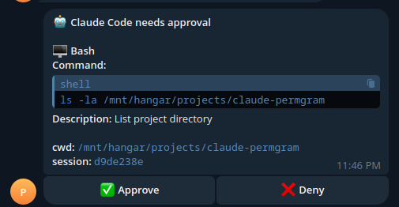

# claude-telegram-approval

> Approve, defer, or deny every Claude Code tool call from Telegram — with feedback, plan review, and AskUserQuestion routing baked in.

[](LICENSE)


A `PreToolUse` hook that intercepts every Claude Code tool call and sends it to Telegram with three buttons — **✅ Approve**, **💻 Terminal** (defer to the normal terminal prompt), **❌ Deny**. Tap deny and you can optionally reply with instructions that go back to Claude as feedback. Built for running Claude Code on a remote server or in the background and driving it from your phone.

It also hooks Claude's `AskUserQuestion` (one Telegram button per option) and `ExitPlanMode` (plan body → Telegram with Approve / Reject buttons).

## Demo



<sub>Replace `docs/demo.png` with a real screenshot after first install.</sub>

## Quick install

```bash
git clone https://github.com/YOUR_USER/claude-telegram-approval.git
cd claude-telegram-approval
./install.sh
```

The installer copies the hook into `~/.claude/hooks/`, merges the `PreToolUse` entry into `~/.claude/settings.json`, writes your credentials to your shell rc, and sends a test message.

## Features

| | |
|---|---|
| **✅ Approve** | Run the tool without any terminal prompt. Explicit `permissionDecision: "allow"`. |
| **💻 Terminal** | Defer to Claude Code's normal in-terminal permission prompt. Useful when you're at the keyboard and want to approve there. |
| **❌ Deny + feedback** | Block the tool. Optionally reply to the follow-up Telegram message with a reason — that text is delivered back to Claude so it can try again differently. |
| **❓ AskUserQuestion** | One Telegram button per option. Tap an option and Claude uses it as the answer without ever prompting the terminal. |
| **📋 Plan review** | When Claude finishes planning and calls `ExitPlanMode`, the plan body shows up in Telegram with Approve / Terminal / Reject buttons. |

## Prerequisites

- **Python 3.8+** (stdlib only — no pip installs)
- **Claude Code** installed and working
- **A Telegram bot** — 60 seconds of setup, next section

## Telegram bot setup

1. Message [@BotFather](https://t.me/BotFather), send `/newbot`, follow the prompts. Save the token.
2. Open a chat with your new bot and send `/start`. Telegram doesn't deliver updates until you've messaged the bot from that chat.
3. Visit `https://api.telegram.org/bot<YOUR_TOKEN>/getUpdates` in a browser. Find `"chat":{"id":…}` — that's your `CLAUDE_TG_CHAT_ID`.

## Configuration

Set these in your shell rc (the installer does it for you) or in `~/.claude/settings.json` under an `env` block:

| Variable                     | Description                                                              | Default | Required |
| ---------------------------- | ------------------------------------------------------------------------ | ------- | -------- |
| `CLAUDE_TG_TOKEN`            | Bot token from @BotFather                                                | —       | yes      |
| `CLAUDE_TG_CHAT_ID`          | Chat ID where approval prompts are sent                                  | —       | yes      |
| `CLAUDE_TG_TIMEOUT`          | Seconds to wait for a button press before auto-denying                   | `300`   | no       |
| `CLAUDE_TG_FEEDBACK_WAIT`    | Seconds to wait for a deny-reason reply after tapping ❌ (0 disables)   | `60`    | no       |
| `CLAUDE_TG_ALLOW_TERMINAL`   | Show the 💻 Terminal button                                              | `true`  | no       |
| `CLAUDE_TG_ALLOW_FEEDBACK`   | Prompt for an optional deny reason after ❌                              | `true`  | no       |
| `CLAUDE_TG_RESPECT_MODE`     | Mirror Claude's `permission_mode` (auto-approve when Claude would)       | `true`  | no       |
| `CLAUDE_TG_FAIL_OPEN`        | `true` → approve on Telegram errors, `false` → deny                      | `true`  | no       |

## How it works

```
  Claude Code                         Telegram                      You
      │                                   │                          │
      │── PreToolUse JSON (stdin) ──┐     │                          │
      │                             ▼     │                          │
      │                  telegram_approval.py                        │
      │                             │                                │
      │                             │── sendMessage ──────────────▶  │
      │                             │        [✅] [💻] [❌]            │
      │                             │                                │
      │    (hook blocks,            │◀── long-poll getUpdates ───┐   │
      │     up to 320s)             │                            │   │
      │                             │                            └───┤
      │                             │                         user taps│
      │                             │◀─── callback_query ────────│   │
      │    if ❌ tapped:            │                                │
      │                             │── sendMessage "Reason?" ──▶   │
      │                             │◀── reply text ────────────────│
      │                             │                                │
      │◀── exit 0 + allow           │── answerCallbackQuery ───▶    │
      │    exit 0 (defer)           │── editMessageText (outcome) ▶ │
      │    exit 2 + deny+reason     │                                │
```

Full protocol with exact JSON payloads: [`docs/how-it-works.md`](docs/how-it-works.md).

## Customization

### Exclude low-risk tools from requiring approval

If you don't want buzzed every time Claude reads a file:

- **Edit the hook script** — open `~/.claude/hooks/telegram_approval.py` and set:
  ```python
  EXCLUDED_TOOLS = ["Read", "Glob", "Grep"]
  ```
- **Or narrow the matcher** in `~/.claude/settings.json`:
  ```json
  "matcher": "Bash|Write|Edit|MultiEdit|WebFetch|WebSearch|Agent|AskUserQuestion|ExitPlanMode"
  ```

Matcher changes are cheaper — they skip invoking the hook entirely for excluded tools.

### Mirror Claude's permission mode

By default, when Claude Code's session is in `acceptEdits` mode, Telegram **doesn't** buzz for Edit/Write/MultiEdit — Claude would auto-approve them anyway. In `bypassPermissions` mode, nothing prompts via Telegram. Flip to strict-always-ask with:

```bash
export CLAUDE_TG_RESPECT_MODE=false
```

### Hide the terminal / feedback options

```bash
export CLAUDE_TG_ALLOW_TERMINAL=false    # buttons become just [✅] [❌]
export CLAUDE_TG_ALLOW_FEEDBACK=false    # deny fires immediately, no reason prompt
```

### Change timeouts

```bash
export CLAUDE_TG_TIMEOUT=600          # 10-minute patience for main button press
export CLAUDE_TG_FEEDBACK_WAIT=120    # 2-minute window to type a deny reason
```

Also bump the `timeout` field in `settings.json` to at least `CLAUDE_TG_TIMEOUT + 20`, otherwise Claude Code will kill the hook before it can time out itself.

### Fail open vs fail closed

By default, `CLAUDE_TG_FAIL_OPEN=true` — if Telegram is unreachable, the hook exits 0 so Claude isn't stuck. For a strict posture:

```bash
export CLAUDE_TG_FAIL_OPEN=false
```

## Troubleshooting

Full guide: [`docs/troubleshooting.md`](docs/troubleshooting.md). Quick hits:

- **Hook never fires** — `claude /hooks` to check registration; inspect `~/.claude/settings.json`.
- **Hook fires but no Telegram message** — env vars aren't in Claude Code's process (check with `env | grep CLAUDE_TG` in the same terminal before launching `claude`).
- **Telegram 401/403** — token wrong, or you never `/start`-ed the bot.
- **Buttons appear but nothing happens** — stale `getUpdates` poller or leftover webhook.

## Contributing

Bug reports and feature requests welcome — templates at [`.github/ISSUE_TEMPLATE/`](.github/ISSUE_TEMPLATE/). PRs adding new tool formatters or improving the UX are especially appreciated.

## License

MIT — see [LICENSE](LICENSE).
